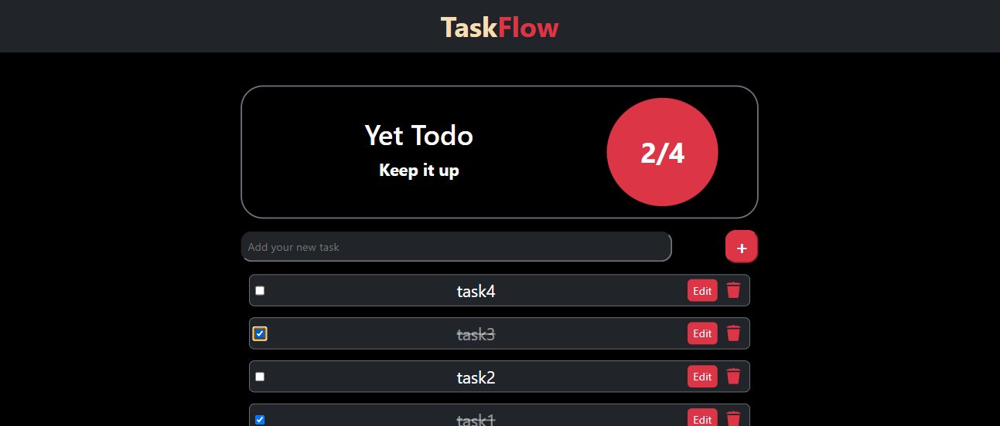
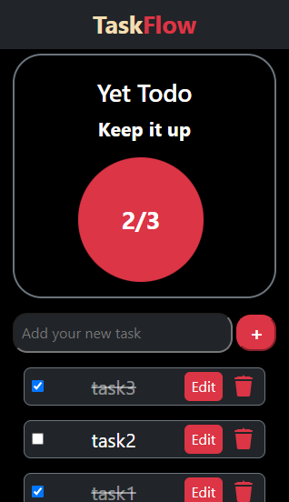

# Todo List Application

## Description

This is a Todo List application designed to help users manage their tasks efficiently. It supports all CRUD (Create, Read, Update, Delete) operations and is built using modern web development technologies.

## Preview

#### PC View


#### Phone View


## Features

- **Add Tasks**: Users can add new tasks to the list.
- **View Tasks**: Users can view all their tasks.
- **Edit Tasks**: Users can edit existing tasks.
- **Delete Tasks**: Users can delete tasks that are no longer needed.
- **Mark as Completed**: Users can mark tasks as completed or incomplete.
- **Responsive Design**: The application is fully responsive and works on all devices.

## Technologies Used

- **Frontend**:
  - ReactJS
  - Bootstrap
- **Backend**:
  - JSON Server (for mock API)
  - Axios (for HTTP requests)
- **Other**:
  - UUID (for unique task IDs)

## Getting Started

Follow these instructions to get a copy of the project up and running on your local machine.

### Prerequisites

Make sure you have the following installed:

- [Node.js](https://nodejs.org/en/)

### Installation

1. **Clone the repository.**

2. **Open the project in VS Code**

3. **Install dependencies**:
    ```sh
    npm install
    ```

4. **Start JSON Server** (in a separate terminal):
    ```sh
    npx json-server --watch db.json --port 3210
    ```

5. **Run the application** (in a different terminal):
    ```sh
    npm start
    ```

### Usage

1. Open your browser and navigate to http://localhost:3000.
2. Use the input field to add new tasks.
3. Use the checkboxes to mark tasks as completed or incomplete.
4. Use the edit button to modify existing tasks.
5. Use the delete button to remove tasks from the list
